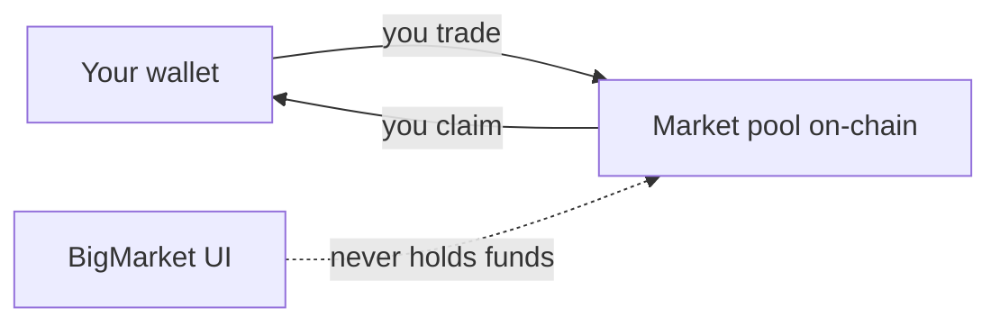

# BigMarket 101

Everything you need to know before you place your first prediction.

---

## What is a prediction market?

**Isn't this just gambling?**

Not exactly. Gambling is you against the house. The house sets the odds, the house takes a cut, and the house always has the edge. A prediction market is different — you're taking a position against other people who disagree with you, and the price you pay reflects how confident the crowd collectively is.

Think of it like this. Imagine a question gets posted: "Will the Euro 2026 final go to penalties?" Two sides open up — Yes and No. People start putting money behind whichever outcome they believe in. If most people think it won't go to penalties, the Yes side gets cheaper to buy — because nobody wants it. If something happens that makes penalties more likely, people rush to buy Yes, the price rises, and No becomes cheaper.

At all times, the price of an outcome is a direct expression of what the crowd thinks the probability is. 60% price means the crowd thinks there's a 60% chance it happens.

When the match ends and the result is known, everyone who backed the right outcome splits the pool. The people who backed the wrong outcome lose their stake.

**So the price actually means something?**

Yes. That's what makes prediction markets genuinely useful — and different from a poll. In a poll, everyone's opinion counts equally. In a prediction market, people put money behind their views. That filters out noise. Someone who just has a hunch is less likely to stake money on it than someone who has done real research. The result is a price that tends to be a better estimate of probability than most other methods.

**What kinds of questions can be markets?**

Almost anything with a clear, verifiable outcome. Will a team win a match. Will a price be above a certain level on a certain date. Will a specific event happen before a deadline. If the answer can be confirmed — yes or no, this number or that number — it can be a market.

---

## Where does my money go?

*Diagram: funds stay in the market pool, not a BigMarket account.*

**Does BigMarket hold my funds?**

No. When you trade on BigMarket, your money goes directly into the market — a sealed pool that exists only for that question. BigMarket never touches it. There is no BigMarket account. There is no company wallet holding your funds.

This is the core promise: the platform is a set of rules, not a custodian. The rules say what happens to the money when a market resolves, and those rules run automatically. No employee at BigMarket could move your money even if they wanted to.

**What if the platform shuts down?**

The markets live on a public network, not on BigMarket's servers. Even if the BigMarket website went offline tomorrow, the underlying markets would still exist and anyone could build an interface to interact with them. Your funds would still be claimable.

**Can I get my money out before the market ends?**

In most markets, yes. BigMarket uses a pricing mechanism that lets you sell your position at any point before the market closes — you get back whatever your shares are currently worth. You're not locked in.

Some markets — simpler, knockout-style ones — don't allow early exit. That's always shown clearly before you enter.

**Who sets the rules for what happens to my money?**

The rules are written in code that anyone can read. They don't change unless the community votes to change them. No individual — not the founders, not the team — can alter how funds flow in or out of a market unilaterally.

---

## What tokens do I need?

**What's a token?**

A token is a digital unit of value that lives on a network — the same way a balance in a bank account is a number tied to your name, except here it's tied to your wallet and the network enforces the rules, not a bank.

BigMarket markets run on specific tokens. The most common ones you'll encounter are:

- **STX** — the native token of the Stacks network. This is the most common token used across BigMarket markets. Think of it as the default currency of the platform.
- **sBTC** — a token that represents Bitcoin, usable within BigMarket markets. One sBTC is always worth one Bitcoin.
- **USDA** — a stablecoin pegged to the US dollar. Its value doesn't move with the crypto market.

Each market specifies which token it uses. You'll always see this before you enter.

**How do I get STX?**

STX is available on most major crypto exchanges — Coinbase, Kraken, Binance, and others. You buy it the same way you'd buy any currency: connect a payment method, enter an amount, and it lands in your exchange account. Then you send it to your wallet.

If you've never done this before, the wallet setup guide walks you through the whole process step by step.

**Do I need a lot of money to start?**

No. There's no minimum stake set by the platform. Some markets may have their own minimums, but most let you start with whatever you're comfortable with. Many people start with small amounts while they're learning how the markets work.

**What is BIG?**

BIG is BigMarket's own token. You don't need BIG to start trading — STX is enough for most markets. BIG is what you earn over time by participating: trading, voting on outcomes, helping keep the platform running. The more you contribute, the more BIG you accumulate. BIG gives you a say in how the platform evolves. More on this in the Positions and Tokens section.

---

## Why can't anyone change the results?

**Who decides when a market resolves?**

For most markets, a group of independent agents monitors the real-world event and signals the outcome once it's clear. They don't decide — they report. Think of them as referees reading the scoreboard, not picking the winner.

Once enough of them agree on the result, the market moves toward resolution. But it doesn't resolve immediately.

**What's stopping someone from reporting the wrong result?**

A cooling-off period. After the result is reported, there's roughly a one-day window where anyone who has a stake in the market can formally challenge it. If someone thinks the result is wrong, they raise a dispute. When that happens, the entire community votes. The vote runs for about two and a half days, and whatever the majority decides becomes the final result.

The key point: no single person — not the agents, not the founders, not a majority shareholder — can force a result through unilaterally. Every result can be challenged. Every challenge goes to a vote.

**What about markets based on data, like a price?**

Those resolve automatically. The result is pulled from a public price feed — the same data anyone can check — and the code applies it directly. No human is involved at all. There's nothing to dispute about whether Bitcoin closed above a certain price on a certain day. The data is public and the code reads it.

**Once a result is recorded, can it ever be changed?**

No. Once a market reaches its final resolved state, that outcome is permanent. It's not a policy that could be overridden. It's a constraint in the code itself. The funds flow to the winners. The market closes. That's it.

---

## Why does this run on a blockchain?

**What even is a blockchain, in plain English?**

A shared record that nobody owns but everybody can read. Every transaction, every result, every fee — it's all written into that record permanently. No single company controls it. No one can go back and quietly edit an entry.

That's the only reason this matters for BigMarket. Not because blockchain is interesting technology. Because it solves a specific trust problem: how do you run a platform where the rules can't be changed on you, results can't be manipulated, and funds can't disappear?

The answer is: you write the rules in code and run them on a network that nobody controls.

**Why does it need to be this way?**

Because the alternative is trusting a company. And companies change their terms. Companies get acquired. Companies have employees who can make mistakes or act in bad faith. Companies can go bankrupt.

When the rules live in code on a public network, none of that applies. The code does what the code says. It doesn't matter who founded the company or what happened to the original team.

**Do I need to understand any of this to use BigMarket?**

No. You need a wallet and some tokens. The technical infrastructure is why you can trust the platform — you don't have to operate it. You don't need to know how the engine works to drive the car.

If you're curious about the underlying architecture, the technical docs go deep. But for trading, predicting, and earning — you just need to get set up.

---

## How do I set up a wallet?

**What is a wallet, exactly?**

A wallet is an app that holds your tokens and lets you interact with platforms like BigMarket. It's not an account with a username and password — it's more like a key. Whoever has the key controls what's inside. BigMarket never has your key. Your bank doesn't have your key. Only you do.

That's what self-custody means. Your money lives in your wallet, and your wallet lives on your device.

**Which wallet do I need?**

BigMarket supports three wallets: Xverse, Leather, and Asigna. For most people starting out, Xverse or Leather are the right choice — both are free, easy to install, and work as browser extensions on desktop or as apps on your phone.

**Step 1 — Install the wallet**

Go to [xverse.app](https://xverse.app) or [leather.io](https://leather.io) and download the extension for your browser, or the app for your phone. Install it the same way you'd install any browser extension or app.

**Step 2 — Create a new wallet**

Open the wallet and choose "Create new wallet." The wallet will generate a seed phrase — a list of 12 or 24 ordinary words in a specific order.

This seed phrase is your wallet. It's the only way to recover your funds if you lose access to your device. Write it down on paper. Store it somewhere safe — not in a screenshot, not in a notes app, not in your email. If someone else gets your seed phrase, they have full access to everything in your wallet.

Once you've written it down, the wallet will ask you to confirm a few of the words in order. This just makes sure you actually saved it before you move on.

**Step 3 — Get some STX**

Your wallet starts empty. To trade on BigMarket, you need STX — the token used across most markets.

You can buy STX on any major crypto exchange: Coinbase, Kraken, Binance, and others all support it. Buy the amount you want to start with, then send it to your wallet address. Your wallet address is a long string of letters and numbers — you'll find it inside the wallet app under "Receive."

The transfer usually takes a few minutes. Once it arrives, your wallet balance updates and you're ready.

**Step 4 — Connect to BigMarket**

Go to [bigmarket.ai](https://bigmarket.ai) and click "Connect Wallet" in the top right. Your wallet app will open and ask you to approve the connection. Click approve. That's it — BigMarket can now see your balance and submit transactions on your behalf, but only when you explicitly confirm each one.

You're never giving BigMarket access to move your funds freely. Every single transaction requires your approval in the wallet.

**What if I make a mistake during setup?**

The only irreversible mistake is losing your seed phrase or sharing it with someone. Everything else — connecting to a wrong site, accidentally closing the app, forgetting your PIN — can be recovered as long as you have your seed phrase.

If you haven't written it down yet, do it now before you do anything else.

*Next: [Your first prediction →]()*
