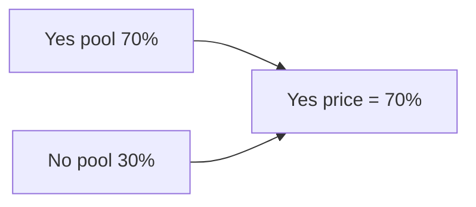
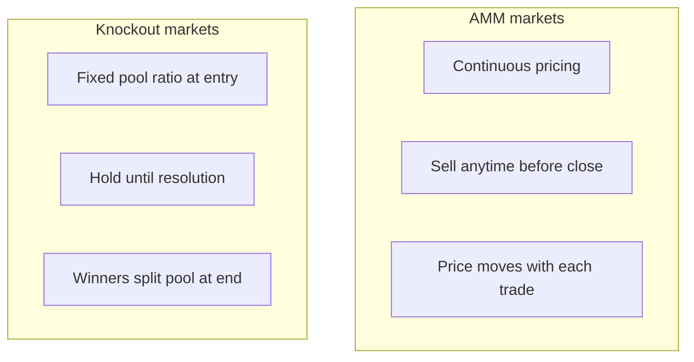

# Prices and How They Move

Why outcome prices change, what they actually mean, and how to use that information.

---

## What does a price mean?

*Diagram: price reflects how much money sits behind each outcome.*

**Is 70% just a number someone picked?**

No. Nobody sets prices on BigMarket. Prices emerge from trading activity — they're a direct reflection of how much money is sitting behind each outcome relative to the total pool.

Think of it like a seesaw. If 70% of all the money in a market is on "Yes", then Yes costs 70 cents per share and No costs 30 cents. The price is just the pool ratio, expressed as a probability. When more people pile into Yes, its price rises. When people sell out of Yes — or pile into No — the price falls.

At any moment, the price of an outcome tells you one thing: what the crowd of people who have put real money on the line collectively thinks the probability is.

**Why should I trust what the crowd thinks?**

You don't have to. But the crowd in a prediction market isn't just expressing opinions — they're backing them with money. That changes behaviour. People who have done research, who have access to good information, or who have genuine expertise are far more likely to stake meaningfully than people who are guessing. The bad guesses tend to get exploited by better-informed traders, which pushes prices back toward reality.

This is why prediction markets have historically been better at forecasting outcomes than polls, expert panels, or media commentary. The mechanism filters for conviction.

---

## How do prices move in AMM markets?

**What actually changes the price when I trade?**

Every time someone buys shares in an outcome, that outcome gets slightly more expensive. Every time someone sells, it gets slightly cheaper. This happens automatically — there's no person on the other side adjusting the price. The market does it mathematically, based on the ratio of tokens in the pool.

The rule is simple: the two outcome pools always multiply to the same number. If one pool grows, the other must shrink proportionally. That keeps the total pool balanced and ensures every trade moves the price in the right direction.

**So if I buy Yes, I'm making Yes more expensive for the next person?**

Yes. And that's intentional. It prevents anyone from buying a large position without moving the market — large trades cost more per share than small ones. This is slippage, and it's a feature, not a bug. It means prices don't get distorted by a single big bet without the rest of the market responding.

**What does the price look like over time?**

In a well-traded market, the price traces the crowd's evolving confidence. Early in a football season, a title market might sit at 20% for several teams. As results come in, the leaders pull away. A key injury drops a team's price. A winning run pushes it up. The price line is essentially a continuous crowdsourced forecast, updated in real time.

---

## How do prices work in Knockout markets?

*Diagram: AMM versus Knockout — flexibility versus simplicity.*

**If there's no continuous pricing, what am I buying?**

In a Knockout market, you're buying a share of the pool at the ratio that exists when you enter. If 60% of the total pool is on Yes when you buy Yes shares, your shares represent a 60%-priced position.

But here's the important difference from AMM: the final payout depends on where the pool ends up at resolution, not where it was when you bought. If a lot more money flows into Yes after your purchase, the pool shifts — but your share of it shrinks proportionally. If money flows out of Yes (which can't happen in Knockout — there's no selling), your position becomes more valuable relative to the pool.

**Is there any strategy to Knockout markets?**

Timing matters more than in AMM markets. The earlier you buy the winning outcome, the better — because you lock in shares before later money dilutes your position. Conversely, if you buy late into a heavily favoured outcome, you're paying a high price for a small slice of the winning pool.

The trade-off for this simplicity: you can't change your mind. Once you're in, you hold until resolution.

---

## What is slippage and should I worry about it?

**What is slippage?**

Slippage is the difference between the price you see when you decide to trade and the price you actually get when the trade executes. It happens because your trade itself moves the price — the larger your trade relative to the pool, the more you move it, and the more your average price diverges from the displayed price.

On a deep, liquid market with lots of money in it, slippage is tiny. On a small or new market, a large trade can move the price noticeably.

**How does BigMarket protect me from slippage?**

When you place a trade, you set a minimum number of shares you're willing to accept. If the price has moved enough by the time your transaction confirms that you'd receive fewer shares than your minimum, the transaction cancels automatically. You get nothing, but you also lose nothing. This is your slippage protection — it's always available, and you should use it.

**How do I set it?**

The interface shows you the estimated shares and the current price before you confirm. You can set your slippage tolerance — a percentage of acceptable movement — directly in the trade window. For most trades on active markets, the default setting is fine. For large trades on thin markets, tighten it.

---

## Does the price tell me who's going to win?

**Should I just bet on whatever is priced highest?**

Not necessarily. A high price means the crowd is confident — but the crowd can be wrong, and that's exactly where the opportunity lies. If you think a 70% priced outcome is actually 90% likely, buying it at 70 cents per share is good value. If you think a 30% priced outcome is actually 50% likely, that's an even better edge.

The price is information. What you do with it depends on what you know that the crowd doesn't.

**What if I'm not sure?**

That's fine too. Many people use prediction markets less as a trading opportunity and more as a way to track how informed, money-backed consensus shifts over time. The price is a better signal than most news commentary — because the people moving it have something at stake.

*Next: [Positions and Tokens →]()*
