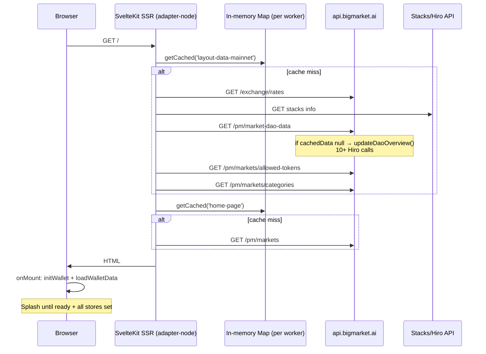

## Page load path (end to end)



### 1. SSR — `+layout.server.ts` (every page)

On cache miss, **5 parallel API calls**:

```24:30:apps/frontend-c1/src/routes/+layout.server.ts
		const [exchangeRates, stacksInfo, daoOverview, tokens, marketCategories] = await Promise.all([
			fetchExchangeRates(appConfig.VITE_BIGMARKET_API),
			fetchStacksInfo(appConfig.VITE_STACKS_API),
			getDaoOverview(appConfig.VITE_BIGMARKET_API),
			getAllowedTokens(appConfig.VITE_BIGMARKET_API),
			getMarketCategories(appConfig.VITE_BIGMARKET_API)
		]);
```

### 2. SSR — `+page.server.ts` (homepage)

Another call: `GET /pm/markets` (Mongo query for featured markets).

### 3. Client — `+layout.svelte` blocks the UI

The splash screen stays up until `onMount` finishes:

```91:104:apps/frontend-c1/src/routes/+layout.svelte
	onMount(async () => {
		if (!browser) return;
		initAppShell(data?.appConfig?.VITE_STACKS_API);
		await loadSystemData(data);
		await initWallet(data?.appConfig?.VITE_BIGMARKET_API);
		await loadWalletData();
		ready = true;
	});
```

For **logged-in users**, `loadWalletData()` now does significantly more work (vault USDC balance, mapped token balances, reputation API) after the recent vault work.

---

## Root causes (ranked by likely impact)

### 1. `/pm/market-dao-data` cold-cache penalty (high)

```31:37:apps/api-v1/src/routes/predictions/predictionMarketRoutes.ts
router.get('/market-dao-data', async (req, res) => {
	const now = Date.now();
	if (!cachedData) {
		await updateDaoOverview();
	}
	lastFetchTime = now;
	res.json(cachedData);
});
```

If `cachedData` is null (API restart, deploy, first request), **every SSR layout load** triggers `updateDaoOverview()`, which makes **many Hiro/Stacks contract reads** plus reputation SDK calls. Cron refreshes hourly; between restarts you're exposed to this.

### 2. SSR in-memory cache doesn't survive PM2 clustering (high)

```6:19:apps/frontend-c1/src/lib/core/server/cache/cache.ts
const cache = new Map<string, CacheEntry<unknown>>();
```

- Cache is **per Node process**
- PM2 with multiple workers → round-robin → frequent cache misses
- Your log showed: `CACHE MISS: loading: exchangeRates, stacksInfo, daoOverview, tokens`

### 3. Frontend cache warmer is disabled (medium)

```10:10:apps/frontend-c1/src/lib/core/server/cache/cache-warmup.ts
// startCacheWarming();
```

`startCacheWarming()` is never invoked anywhere. The SSR app does not self-warm.

### 4. API cache warmer may be ineffective or counterproductive (medium)

```10:34:apps/api-v1/src/routes/cache/cache_utils.ts
export async function updateUICache() {
	const base = getConfig().publicAppBaseUrl;
	// ...
	for (const url of urls) {
		await fetch(url, { method: 'GET', ... });
	}
}
```

Issues:

- `publicAppBaseUrl` is hardcoded to `http://localhost:3000` on non-devnet — **no env override**
- Fetches **every market page sequentially** — slow, competes with real traffic
- Warms **one PM2 worker** at random; user's next request may hit a different worker → still a miss

### 5. Client splash blocks on wallet init (medium–high for logged-in users)

Even after SSR completes, users wait for `initWallet()` + `loadWalletData()` before seeing the app. Logged-in users pay extra for vault/reputation fetches.

### 6. `POST /extensions` — not a factor

This route is unrelated to page load. The unused `updateUICache` import in `daoEventsRoutes.ts` is dead code.

### 7. Minor cache bugs

- Home cache key is `'home-page'` with **no network suffix** (devnet/mainnet collision if same process)
- `+layout.server.ts` logs `CACHE MISS` only on **error path**, then returns `{}` — misleading logs and empty layout on failure

---

## What changed recently

| Change                                               | Effect on load time                                                            |
| ---------------------------------------------------- | ------------------------------------------------------------------------------ |
| Vault / `loadWalletData` expansion (Jun 2026)        | Slower **client** ready for logged-in users                                    |
| `updateDaoOverview` reputation SDK calls (`t1`–`t3`) | Slower **cold** `/market-dao-data`                                             |
| Auth OAuth in ConnectLanes                           | **No impact** on page load (only when deposit modal opens)                     |
| `POST /latest-events` refactor                       | Still calls `updateUICache` via `readDaoEventsInternal` — admin/cron path only |

---

## Recommended fixes (in priority order)

1. **`/market-dao-data` should never block on cold start for SSR** — return stale `cachedData` if present, or serve last-known + refresh async; don't run full `updateDaoOverview()` inline on user requests.

2. **Re-enable frontend cache warming** in the PM2 entrypoint (`startCacheWarming()`), with correct network-scoped keys.

3. **Fix `publicAppBaseUrl`** via env (e.g. `mainnet_sui_publicAppBaseUrl=https://bigmarket.ai`) or derive from `authFrontendReturnUrl`.

4. **Shared cache for PM2** (Redis) or run SSR with **1 worker** if you rely on in-memory cache.

5. **Don't block the splash on wallet init** — show the app after SSR hydration; load wallet data in background.

6. **Remove dead `updateUICache` import** from `daoEventsRoutes.ts`; consider making API cache warming parallel + rate-limited.

---

Want me to implement the top fixes (non-blocking `/market-dao-data`, re-enable SSR cache warming, fix `publicAppBaseUrl`)?
